# Quantime 需求文档

[TOC]


## 文档说明

### 更新日志

| 更新者 | 更新时间  | 更新内容                                           | 备注 |
| ------ | --------- | -------------------------------------------------- | ---- |
| 剩女   | 2021.4.1  | initialize                                         |      |
| 豌射   | 2021.5.25 | 新增产品概述，开发背景<br />更新用户画像，产品结构 |      |


## 编撰用

手册说明

产品手册应当包括

+ 产品定位
+ 开发背景（需求分析
  + 这里包括你之前的问卷的结果分析
+ 用户画像
+ 产品结构
+ 功能列表
+ ……

前端手册应当包括

+ 页面说明
+ 页面逻辑
+ 重点前端构思的说明（我们的那个滑动）及实现方法

云开发手册应当包括

+ 数据库设计
+ API设计
+ 数据通路


## 产品概述

### 产品介绍

Quantime是由氵卓月团队在2021年开放的一款时间统计小程序，支持自动生成可供选择的时间区间选项，给出可视化的快捷统计结果。


### 产品定位

Quantime是一款简单易用、轻量高效的时间统计微信小程序，帮助用户快速发布时间统计表单，即时查看准确清晰的统计结果，满足不同场景下用户协同开展时间安排的需求。


### 产品特点

* 程序自动生成精确到每小时的时间区间颗粒选项，减少表单发布负担
* 时间区间颗粒选项匹配时间轴，简单直观，减少表单填写负担
* 时间统计结果支持可视化colorbar显示，整体情况一眼纵览
* 统计结果详情支持查看具体时间点参与人员，交互方便


## 开发背景

### 背景概述

微信10年，依托微信的社交私域流量，微信小程序已经成为一种新的应用形态，表单统计分发场景时常见于微信之中，其中，有一类统计需求：时间统计，在当今疫情加速高效线上协同管理办公，微信小程序应用场景进一步拓宽的背景下，却没有得到应有的重视，旧有方案难以适应移动端交互形态，拖累协作效率。

### 调研分析

聚焦时间统计这一需求，我们在朴素的“打造移动端交互方便的时间统计产品”这一想法基础上，开展前期用户访谈以进行需求挖掘，得到需求列表后制作访谈问卷分析核心需求，分析结果如下：

#### 1.  问卷基本情况说明

​	本次问卷调查共收集到有效问卷106份，年龄段集中在18-22岁（100%），职业以全日制学生为主（98.11%）。


#### 2.  时间统计需求验证

1. 时间统计需求场景广泛

   时间统计需求场景涉及广泛，包含课程讨论、工作讨论、聚餐、娱乐出游等，且场景覆盖率极高，上述场景发起时间统计的需求覆盖率均达到60%以上，其中，课程讨论的发起场景覆盖率达86%以上，参与覆盖率达94%以上。

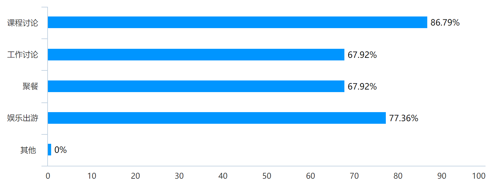

条形图：您日常有哪些 发起 时间统计的场景？


条形图：您日常有哪些 参与 时间统计的场景？


2. 时间统计需求频率可观

   时间统计需求具备相当可观的频率，过半数填写者表示平均每月发起 1-2次时间统计，平均每周参与1-2次时间统计，更有一部分填写者具有平均每周发起1-2次或更多时间统计，平均每周参与3-4次时间统计的需求，有望转化为产品的铁杆用户。
   
   

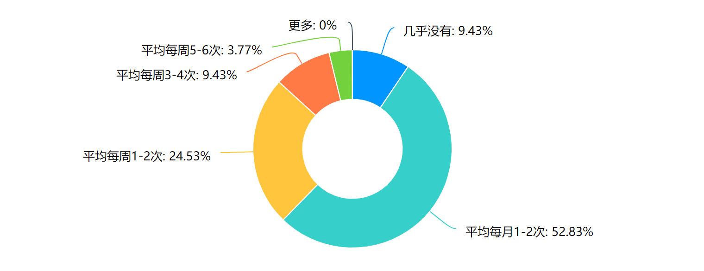

圆环图：您平常 发起 时间统计的频率是？

   

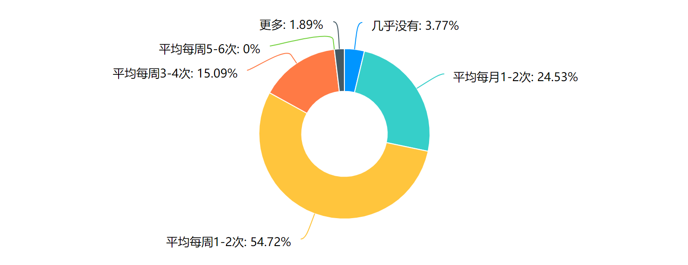

圆环图：您平常 参与 时间统计的频率是？


#### 3.  时间统计需求挖掘

我们首先调查受访者的之前使用时间统计形式和他们觉得可能存在的问题。

时间统计形式以“群聊内发消息统计”和“问卷：发布者设置选择题选项，让参与者选择”为主，均占到75%以上的比例。

而在调查现有的时间统计形式可能存在的问题时，仅有不到8%的受访者表示“不觉得有问题”，而“无法快速检查所有填写人员”、“无法根据特定人员筛选或排序”、“每次都需要手动设置时间，较为麻烦”、“需要人工确认时间”等都是显著痛点。

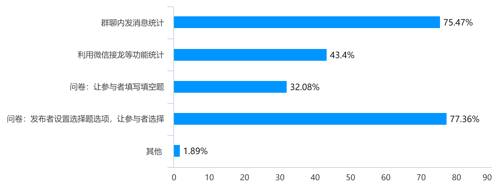

条形图：平常用过的时间统计形式有？


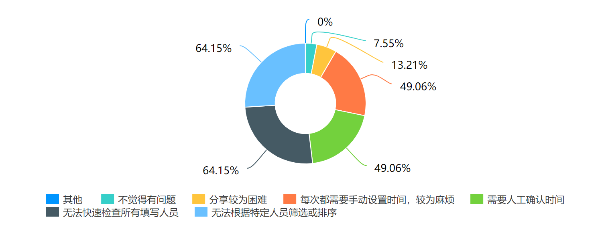

环形图：您觉得现有的时间统计形式可能有的问题是？


#### 4.  时间统计需求分析

最后，我们根据筛选出的需求列表，邀请问卷填写者为需求进行排序：

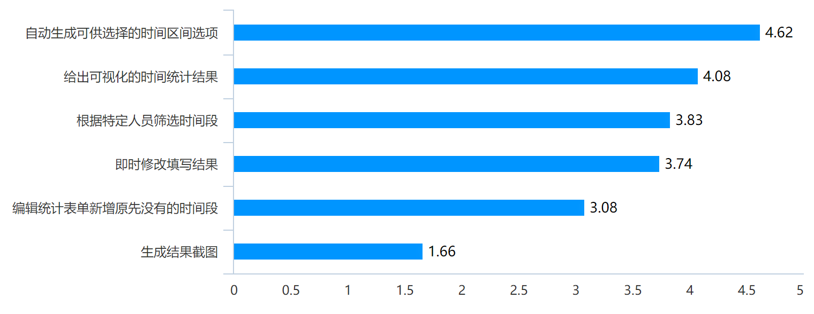

条形图：请您为下列时间统计的需求排序（计算得分越高越优先）

#### 5.  其他需求分析

在我们所列的核心需求列表外，我们还邀请受访者填写可能遇到的困难和为一些需求的必要性打分，来帮助我们筛选需求列表，确保没有重要需求遗漏在外：

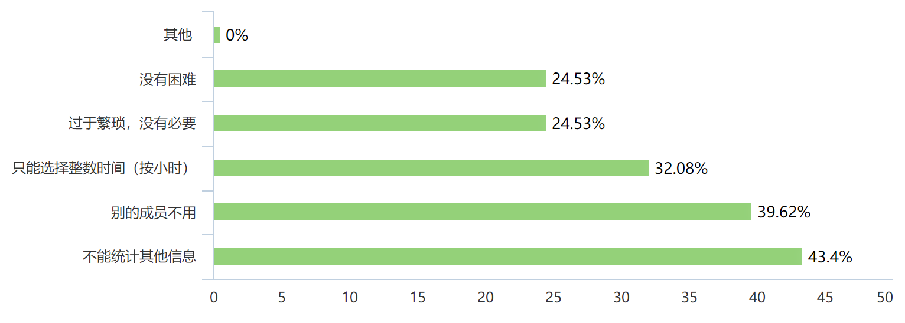

条形图：如果有一款小程序可以：……您觉得在使用它的过程中可能会遇到什么困难？


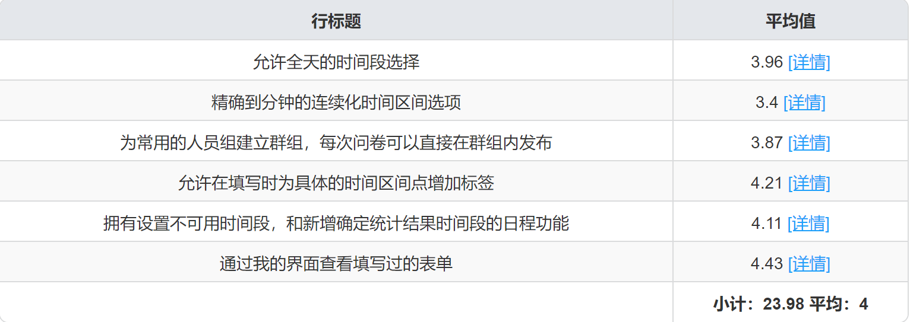

表格：请您为下列功能的必要性打分


### 需求小结

省略


## 用户画像

基于前期用户访谈和调查问卷的结果，我们总结提炼了Quantime的典型用户画像如下：

+ 班团干部勇当组长 —— 小林

  * 形象：具备领导力，勇于站出来的小林，经常主动担任各种课程小组的组长，也是班长和某组织的中管。

  + 场景：每次需要统计组员，部门成员时间手动设置时间选项都非常麻烦，并且需要人工下载结果，肉眼分析。
  + 需求：希望有程序可以自动生成时间选项，统计结果时能够一眼看到直观结果，拯救选择困难症。

+ 聚餐出游娱乐达人 —— 小黄

  * 形象：喜欢和朋友聚餐出游的小黄，计划着每逢周末节假日就要和朋友们或近或远的游玩。
  * 场景：希望能够快速统计和朋友的共有空闲时间，而不用再发送很多条聊天消息反复确认。
  * 需求：方便快捷的时间统计产品，节省发送多条聊天消息的时间和精力。

+ 学习工作四处奔忙 —— 小杨

  + 形象：学习勤奋，工作认真的小杨，奔波于紫金港、玉泉两个校区之间，经常需要参加各种课程小组讨论、科研组会、组织工作小会等。
  + 场景：各种活动，每次组长或组织者统计时间时都是问卷，一个个看文字选时间非常麻烦。
  + 需求：有一个符合直观感受的类时间轴式时间选择的交互。


## 产品结构

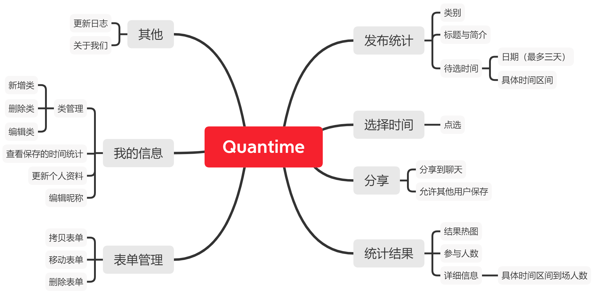


## 功能说明

**时间统计：**

+ 发布统计

  + 可以选择需要统计的时间
  + 可以选择时间粒度
    + 允许全天选择

+ 分享统计

  + 二维码分享
  + 链接分享
  + 分享到群聊

+ 用户选择

  + 点选，批量选择
  + 可以即时修改

+ 修改表单状态

  + 允许/暂停填写
  + 允许/禁止其他用户查看统计结果
  + 新增原先没有的时间段
  + 删除表单
  + 拷贝表单

+ 结果统计

  + 整体热图
  + 每个时间段的具体到场人数
  + 根据用户筛选时间
  + 生成结果截图

+ UI功能：

  + 搜索人名，表单名
  + 为表单新建集合

  

## 页面逻辑


## 页面结构

+ components

  + tabbar
  + (Time需要的)
    + FormDisplay: 表单组件
    + TimeBar：时间条组件，用于发布选择，和对象点选
    + Calendar：日历组件
    + TouchBar：选择具体日期的组件（也就是表盘的替代品）

  

+ Login：登录页面

+ Mine：我的

+ Home: 主页，两个按钮

  + TeamMain： 待开发

  + TimeMain：当前核心功能，首页就是各个表单

    + Form：表单具体页面，一些设置和跳转处

    + （发布逻辑）

      + TimePublish：发布时选择时间的页面
      + FormShared：分享出去的表单页面

    + （从分享处进入）

      + TimeSelect：用户选择时间的页面

    + （统计结果）

      + Stat：统计结果页面

        


## 云开发

### 数据库设计

使用小程序的云数据库，基于其自动生成主键`_id`，可以较为方便的存储对象，列表等特性，我们可以简化我们的数据库设计。

数据库设计的**ER图**如下：

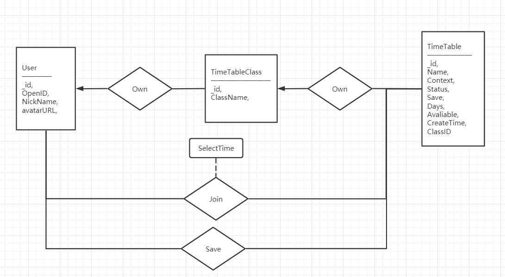

可以将其转化为以下五张表

#### 实体集

**User**

```sql
create table User(
    _id varchar(20) NOT NULL COMMENT '使用小程序自动生成的_id',
	OpenID varchar(20) NOT NULL COMMENT 'VX OpenID',
    NickName varchar(20) NOT NULL COMMENT 'Name displayed',
    avatarURL varchar(100) COMMENT 'user avatar from vx itself',
    primary key(_id)
)
```


**TimeTableClass**

```sql
create table TimeTableLClass(
    _id varchar(20) NOT NULL COMMENT '使用小程序自动生成的Class的_id， aka, Class',
    ClassName varchar(20) NOT NULL COMMENT 'Name of Class'
    OpenID varchar(20) NOT NULL COMMENT 'User OpenID belonged to'
    primary key(_id)
)
```


**TimeTable**

```sql
create table TimeTable(
    _id varchar(20) NOT NULL COMMENT '使用小程序自动生成的Table的_id， aka, TableID',
    Name varchar(20) NOT NULL COMMENT 'Name of Table',
    Context varchar(100) NOT NULL comment 'Context',
    Status int NOT NULL COMMENT 'Status of the table listed in the following',
    Save int NOT NULL COMMENT 'Whether the table can be saved by others'
    Days List NOT NULL comment 'up to 3 days selected stored in string',
    Avaliable List NOT NUMM comment 'The quantum time situation marked for each Day, -1 means disabled, 0 means abled',
    CreateTime datetime not null comment 'Create Time',
    ClassID varchar(20) not null comment 'Class ID belonged to'
    primary key(TableID)
)
```

| status code | 状态                 |
| ----------- | -------------------- |
| **0**       | 未发布，禁止用户填写 |
| **1**       | 发布，允许用户填写   |

| save code | 状态         |
| --------- | ------------ |
| **0**     | 禁止用户保存 |
| **1**     | 允许用户保存 |


#### 关系集

**TimeTable_Member_Relation**： 用户填写表单的关系记录

```sql
create table TimeTable_Member_Relation(
    _id varchar(20) NOT NULL COMMENT '使用小程序自动生成的关系的_id',
    TableID int not null comment 'Time Table ID',
    UserID varchar(20) not null comment 'User open id',
    SelectTime List not null comment 'Selected time in List Form',
    primary key(_id)
)
```


**TimeTable_Save_Relation**：用户保存表单到本地的关系记录

```sql
create table TimeTable_Save_Relation(
    _id varchar(20) NOT NULL COMMENT '使用小程序自动生成的关系的_id',
    TableID int not null comment 'Time Table ID',
    UserID varchar(20) not null comment 'User open id',
    primary key(_id)
)
```


### 云函数API开发

通过云函数的方式，在小程序端提供调用数据库及进行简单数据处理的接口

云函数与参数一栏

| 类型                 | 名称                 | 参数                                            | 功能                                     |
| -------------------- | -------------------- | ----------------------------------------------- | ---------------------------------------- |
| Get - 用户信息       | Login                | /                                               | app.js中判断用户注册状态                 |
| Post - 用户信息      | UserRegister         | avatarURL<br/>NickName                          | 注册/更新用户的头像与昵称                |
| Get - 用户信息       | getUserInfo          | /                                               | 获取用户的头像与昵称                     |
| Post - add - 类信息  | AddTimeTableClass    | ClassName                                       | 为用户新增类                             |
| Post - add - 表单    | AddTimeTable         | Name/Context/BelongClassID<br/>Days/Status/Save | 为某个类新增一个表单                     |
| Post - add - 关系    | JoinTimeTable        | TableID                                         | 用户加入填写某一表单                     |
| Post - alter - 表单  | AlterTimeTableInfo   | TableID<br>可选：NewStatus/NewSave...等更新信息 | 更新表单内容                             |
| Post - alter - 类    | AlterTimeSelected    | TableID / SelectTime                            | 修改已选择的日期                         |
| Get - 类与表信息     | GetTableInfo         | /                                               | 获取用户所有的类与表的信息               |
| Get - 仅类信息       | GetClassList         | /                                               | 仅获取用户所有的类的信息                 |
| Post - delete - 表单 | DeleteTimeTable      | TableID                                         | 删除表单与其相关的关系中的信息           |
| Post - delete - 类   | DeleteTimeTableClass | ClassID                                         | 删除类并递归删除所有属于该类的表单的信息 |
| Post - CopyTable     | CopyTable            | ClassID / TableID                               | 将表单拷贝到对应的类下                   |
| Post - 保存表单      | SaveToMine           | TableID                                         | 保存对应的表单                           |
| Get - 保存表信息     | GetSavedTable        | /                                               | 获取用户所有保存的表单列表               |
| Get - 统计信息       | GetStat              | TableID                                         | 获取表单的统计结果                       |
| Get - SelectTime     | GetSelectTime        | TableID                                         | 获取用户在某个表单的选择时间结果         |

 

### 前后端联调

这里列出几条比较重要的前后端数据通路

**新建表单并分享的流程**

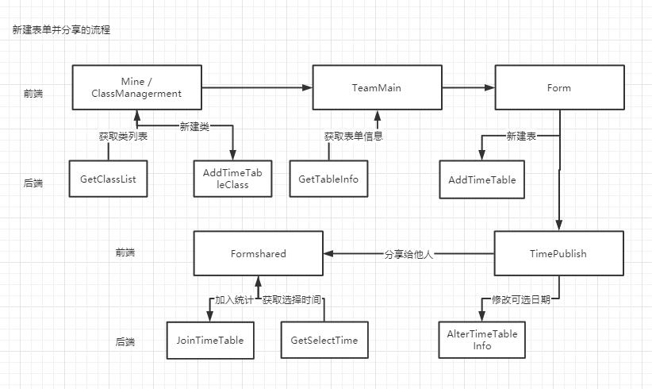


**观察统计结果的通路**

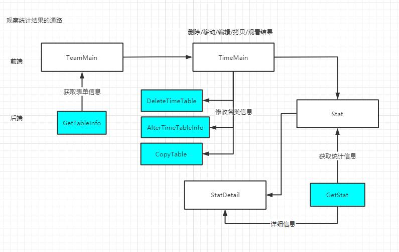

