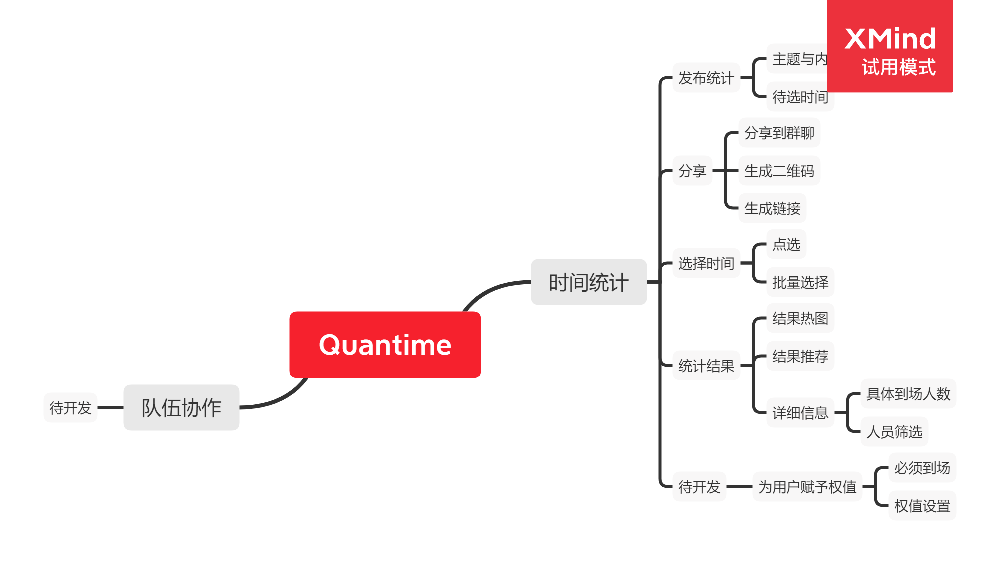
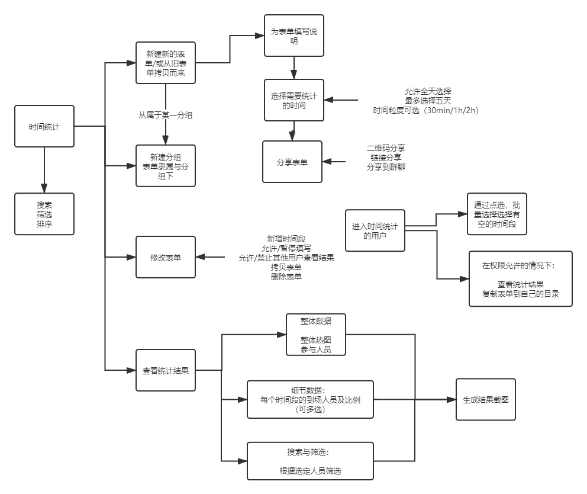

# Quantime 需求文档

[TOC]


## 文档说明

### 更新日志

| 更新者 | 更新时间 | 更新内容   | 备注 |
| ------ | -------- | ---------- | ---- |
| 剩女   | 2021.4.1 | initialize |      |


## 产品结构



## 用户画像

+ 青椒炒蛋 —— 马原课的组长

  + 场景：每次需要统计组员时间都非常麻烦，并且需要人工下载结果，肉眼分析。
  + 需求：能够自动得出推荐的选择时间，拯救选择困难症。

+ 麦芽炒蛋 —— 史纲课的组员

  + 场景：每次组长统计时间时都是问卷，一个个看文字选时间非常麻烦，而且选错了还修改麻烦
  + 需求：有一个可以实时修改的问卷

  

## 功能说明

**时间统计：**

+ 发布统计

  + 可以选择需要统计的时间
  + 可以选择时间粒度
    + 允许全天选择

+ 分享统计

  + 二维码分享
  + 链接分享
  + 分享到群聊

+ 用户选择

  + 点选，批量选择
  + 可以即时修改

+ 修改表单状态

  + 允许/暂停填写
  + 允许/禁止其他用户查看统计结果
  + 新增原先没有的时间段
  + 删除表单
  + 拷贝表单

+ 结果统计

  + 整体热图
  + 每个时间段的具体到场人数
  + 根据用户筛选时间
  + 生成结果截图

+ UI功能：

  + 搜索人名，表单名
  + 为表单新建集合

  

## 页面逻辑




## 页面结构

+ components

  + tabbar
  + (Time需要的)
    + FormDisplay: 表单组件
    + TimeBar：时间条组件，用于发布选择，和对象点选
    + Calendar：日历组件
    + TouchBar：选择具体日期的组件（也就是表盘的替代品）

  

+ Login：登录页面

+ Mine：我的

+ Home: 主页，两个按钮

  + TeamMain： 待开发

  + TimeMain：当前核心功能，首页就是各个表单

    + Form：表单具体页面，一些设置和跳转处

    + （发布逻辑）

      + TimePublish：发布时选择时间的页面
      + FormShared：分享出去的表单页面

    + （从分享处进入）

      + TimeSelect：用户选择时间的页面

    + （统计结果）

      + Stat：统计结果页面

        


## 云开发

### 数据库设计

使用小程序的云数据库，基于其自动生成主键`_id`，可以较为方便的存储对象，列表等特性，我们可以简化我们的数据库设计。

#### 实体集：

**User**

```sql
create table User(
    _id varchar(20) NOT NULL COMMENT '使用小程序自动生成的_id',
	OpenID varchar(20) NOT NULL COMMENT 'VX OpenID',
    NickName varchar(20) NOT NULL COMMENT 'Name displayed',
    avatarURL varchar(100) COMMENT 'user avatar from vx itself',
    primary key(_id)
)
```


**TimeTableClass**

```sql
create table TimeTableLClass(
    _id varchar(20) NOT NULL COMMENT '使用小程序自动生成的Class的_id， aka, Class',
    ClassName varchar(20) NOT NULL COMMENT 'Name of Class'
    OpenID varchar(20) NOT NULL COMMENT 'User OpenID belonged to'
    primary key(_id)
)
```


**TimeTable**

```sql
create table TimeTable(
    _id varchar(20) NOT NULL COMMENT '使用小程序自动生成的Table的_id， aka, TableID',
    Name varchar(20) NOT NULL COMMENT 'Name of Table',
    Context varchar(100) NOT NULL comment 'Context',
    Status int NOT NULL COMMENT 'Status of the table listed in the following',
    Save int NOT NULL COMMENT 'Whether the table can be saved by others'
    Days List NOT NULL comment 'up to 3 days selected stored in string',
    Avaliable List NOT NUMM comment 'The quantum time situation marked for each Day, -1 means disabled, 0 means abled',
    CreateTime datetime not null comment 'Create Time',
    ClassID varchar(20) not null comment 'Class ID belonged to'
    primary key(TableID)
)
```

| status code | 状态                 |
| ----------- | -------------------- |
| **0**       | 未发布，禁止用户填写 |
| **1**       | 发布，允许用户填写   |

| save code | 状态         |
| --------- | ------------ |
| **0**     | 禁止用户保存 |
| **1**     | 允许用户保存 |


#### 关系集

**TimeTable_Member_Relation**： 用户填写表单的关系记录

```sql
create table TimeTable_Member_Relation(
    _id varchar(20) NOT NULL COMMENT '使用小程序自动生成的关系的_id',
    TableID int not null comment 'Time Table ID',
    UserID varchar(20) not null comment 'User open id',
    SelectTime List not null comment 'Selected time in List Form',
    primary key(_id)
)
```


**TimeTable_Save_Relation**：用户保存表单到本地的关系记录

```sql
create table TimeTable_Save_Relation(
    _id varchar(20) NOT NULL COMMENT '使用小程序自动生成的关系的_id',
    TableID int not null comment 'Time Table ID',
    UserID varchar(20) not null comment 'User open id',
    primary key(_id)
)
```


### API开发

通过云函数的方式，在小程序端提供调用数据库及进行简单数据处理的接口

#### AddTimeTableClass

新增一个TimeTableClass

参数

```json
{
    "ClassName": "New Class Name"
}
// openid 从getWXContext中获取
```


涉及到的表：

+ TimeTableClass表中新增Class实体
+ User_TimeTableClass_Relation中新增类所属用户的关系


#### AddTimeTable

新增一个TimeTable表单

```json
{
    "Name": string,
    "Status": int,
    "Context": string,
    "BelongClassID": ID string
}
// days is set to [] because it is not chosen yet
// Table ID can be get after create Table
```

涉及到的表：

+ TimeTable：表单实体新增
+ TimeTableClass_TimeTable_Relation：新增关系


#### AlterTimeSelected

修改用户选择的时间段

```json
{
    "TableID": ID string,
    "UserID": ID string,
    "SelectTime": json 
}
```

涉及到的表：

+ TimeTable_Member_Relation：需要查询是否有关系存在，并获取RelationID
+ TimeTable_Member_Relation：修改已选择的时间段


#### AlterTimeTableBelong

移动表单到其他类下

```sql
{
	"TableID": ID string,
	"NewBelongClassID": ID string
}
```

涉及到的表：

+ TimeTableClass：先确认ClassID是否存在
+ TimeTableClass_TimeTable_Relation：修改关系


#### AlterTimeTableInfo

修改TimeTable的Info

```sql
{
	"TableID": ID string,
	// next are options
	"NewStatus": int,
	"NewContext": string
}
```

涉及到的表：

+ TimeTable：修改实体


#### JoinTimeTable

用户加入TimeTable

```json
{
    "TableID": ID string,
    "UserID": ID string. // Open ID
}
```

涉及到的表：

+ TimeTable_Member_Relation：查找关系是否已经存在
+ TimeTable_Member_Relation：新增关系


#### DeleteTimeTable

删除一个TimeTable

```json
{
    "TableID": ID string
}
```

涉及到的表：

+ TimeTable：删除实体
+ TimeTableClass_TimeTable_Relation：删除关系
+ TimeTable_Member_Relation：删除关系


#### DeleteTimeTableClass

删除一个分类并且级联删除下面的表单

```json
{
    "ClassID": ID string
}
```

涉及到的表：

+ TimeTableClass：删除实体
+ TimeTable：删除若干实体
+ TimeTableClass_TimeTable_Relation：删除关系
+ TimeTable_Member_Relation：删除关系