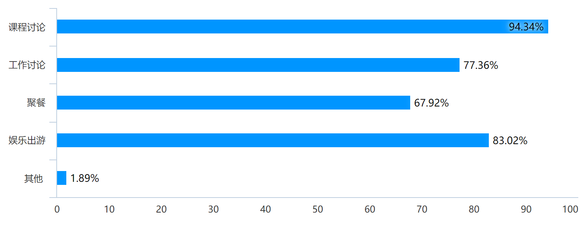

# Quantime 需求文档

[TOC]


## 文档说明

### 输出环境

| 文档名称     | Quantime 微信小程序 V1.3.5_PRD |
| ------------ | ------------------------------ |
| **版本**     | **V1.3.5**                     |
| **撰写人**   |                                |
| **撰写时间** | **2021.5.29**                  |


### 更新日志（这个不写在最终版里）

| 更新者 | 更新时间  | 更新内容                                                     | 备注 |
| ------ | --------- | ------------------------------------------------------------ | ---- |
| 剩女   | 2021.4.1  | initialize                                                   |      |
| 豌射   | 2021.5.25 | 新增产品概述，开发背景<br />更新用户画像，产品结构           |      |
| 剩女   | 5.26      | ctrl F修改意见即可看到修改意见                               |      |
| 豌射   | 2021.5.25 | 新增需求小结<br />更新用户画像，产品结构                     |      |
| 豌射   | 2021.5.28 | 新增输出环境，交互设计的原则与思路<br />更新功能说明，页面逻辑<br />调整产品介绍、产品特点、调研分析、用户画像、需求小结、产品运营、推广与未来发展方向 |      |


## 产品概述

### 产品介绍

Quantime是由**氵卓月团队**在2021年开放的一款时间统计小程序，支持自动生成可供选择的时间区间选项，给出可视化的快捷统计结果。

Quantime通过 Quantum time（时间量子）的物理学概念打造核心产品逻辑，塑造全新的移动交互时间统计哲学。


### 产品定位

Quantime是一款简单易用、轻量高效的时间统计微信小程序，帮助用户快速发布时间统计表单，即时查看准确清晰的统计结果，满足不同场景下用户协同开展时间安排的需求。


### 产品特点

* 程序自动生成时间量子概念（按小时粒度）的可选时间选项，减少表单发布负担
* 时间量子颗粒选项匹配时间轴，简单直观，减少表单填写负担
* 时间统计结果支持可视化热图（colorbar）显示，整体情况一眼纵览
* 统计结果详情支持查看带首字母的具体时间参与者列表展示，交互方便


## 产品背景

### 背景概述

微信10年，依托微信的社交私域流量，微信小程序已经成为一种新的应用形态，表单统计分发场景时常见于微信之中，其中，有一类统计需求：时间统计，在当今疫情加速高效线上协同管理办公，微信小程序应用场景进一步拓宽的背景下，却没有得到应有的重视，旧有方案难以适应移动端交互形态，拖累协作效率。

### 调研分析

聚焦时间统计这一需求，我们在朴素的“打造移动端交互方便的时间统计小程序”这一想法基础上，开展前期用户访谈以进行需求挖掘，得到需求列表后制作访谈问卷分析核心需求，分析结果如下：

#### 1.  问卷基本情况说明

​	本次问卷调查共收集到有效问卷106份，年龄段集中在18-22岁（100%），职业以全日制学生为主（98.11%）。


#### 2.  时间统计需求验证

1. 时间统计需求场景广泛

   时间统计需求场景涉及广泛，包含课程讨论、工作讨论、聚餐、娱乐出游等，且场景覆盖率极高，上述场景发起时间统计的需求覆盖率均达到60%以上，其中，课程讨论的发起场景覆盖率达86%以上，参与覆盖率达94%以上。


条形图：您日常有哪些 发起 时间统计的场景？



条形图：您日常有哪些 参与 时间统计的场景？


2. 时间统计需求频率可观

   时间统计需求具备相当可观的频率，过半数填写者表示平均每月发起 1-2次时间统计，平均每周参与1-2次时间统计，更有一部分填写者具有平均每周发起1-2次或更多时间统计，平均每周参与3-4次时间统计的需求，有望转化为产品的铁杆用户。


圆环图：您平常 发起 时间统计的频率是？

   


圆环图：您平常 参与 时间统计的频率是？


#### 3.  时间统计需求挖掘

我们首先调查受访者的之前使用时间统计形式和他们觉得可能存在的问题。

时间统计形式以“群聊内发消息统计”和“问卷：发布者设置选择题选项，让参与者选择”为主，均占到75%以上的比例。

而在调查现有的时间统计形式可能存在的问题时，仅有不到8%的受访者表示“不觉得有问题”，而“无法快速检查所有填写人员”、“无法根据特定人员筛选或排序”、“每次都需要手动设置时间，较为麻烦”、“需要人工确认时间”等都是显著痛点。


条形图：平常用过的时间统计形式有？


环形图：您觉得现有的时间统计形式可能有的问题是？


#### 4.  时间统计需求分析

最后，我们根据筛选出的需求列表，邀请问卷填写者为需求进行排序：


条形图：请您为下列时间统计的需求排序（计算得分越高越优先）

#### 5.  其他需求分析

在我们所列的核心需求列表外，我们还邀请受访者填写可能遇到的困难和为一些需求的必要性打分，来帮助我们筛选需求列表，确保没有重要需求遗漏在外：


条形图：如果有一款小程序可以：……您觉得在使用它的过程中可能会遇到什么困难？


| 功能                                                 | 打分平均值（满分5分） |
| ---------------------------------------------------- | --------------------- |
| 通过我的界面查看填写过的表单                         | 4.43                  |
| 拥有设置不可用时间段，和新增确定统计时间段的日程功能 | 4.11                  |
| 允许在填写时为具体的时间区间点增加标签               | 4.02                  |
| 允许全天的时间段选择                                 | 3.96                  |
| 为常用的人员组建立群组，每次问卷可以直接在群组内发布 | 3.87                  |
| 精确到分钟的连续化时间区间选项                       | 3.4                   |

表格：请您为下列功能的必要性打分


### 用户画像

基于前期用户访谈和调查问卷的结果，我们总结提炼了Quantime的典型用户画像如下：

+ 班团干部勇当组长 —— 小林

  * 形象：具备领导力，勇于站出来的小林，经常主动担任各种课程小组的组长，也是班长和某组织的中管。

  + 场景：每次需要统计组员，部门成员时间手动设置时间选项都非常麻烦，并且需要人工下载结果，肉眼分析。
  + 需求：希望能减少发布和开展时间统计的精力和时间成本，发布时避免手动设置时间区间选项，统计结果时能够一眼看到直观结果，拯救选择困难症。

+ 聚餐出游娱乐达人 —— 小黄

  * 形象：喜欢和朋友聚餐出游的小黄，平时想见缝插针和同学室友聚餐娱乐，每逢周末节假日也要和朋友们或近或远的出行游玩。
  * 场景：希望能够快速统计和朋友的共有空闲时间，充分利用朋友之间的的碎片化时间，找到大家空闲时间意想不到的交集，而不用再发送很多条聊天消息反复确认，减少约时间的负担，让聚餐出游更尽兴。
  * 需求：方便快捷的时间统计产品，节省发送多条聊天消息的时间和精力，同时能够找到足够精细共有时间，提高找到共同时间的概率。

+ 学习工作四处奔忙 —— 小杨

  + 形象：学习勤奋，工作认真的小杨，奔波于紫金港、玉泉两个校区之间，经常需要参加各种课程小组讨论、科研组会、组织工作小会等。
  + 场景：各种活动，每次组长或组织者统计时间时都是问卷，问卷时间区间太大日程安排困难，填写填空题又担心让组织者为难，并且一个个看文字选时间非常麻烦。
  + 需求：希望有符合直观感受的时间选择的交互，能够方便地填写问卷，同时可供选择的时间粒度精细，提高时间利用率。


### 需求小结

基于对时间统计的需求挖掘和痛点分析，并结合排序等方式进行需求强度验证，我们概括了2大核心需求：**希望能够降低发布和填写时间统计的成本，避免手动设置的时间区间选项**，**希望能够有直观清晰、一眼总览的统计结果**。

具体剖析2大核心需求，我们发现它们具体可以分为很多小的需求点，对应地，我们在小程序设计中对症下药打造了相应的功能。

以下是具体的需求列表，序号从前往后表示优先级从高到低。

| 序号 | 优先级 | 问题需求                                                     | 对应功能                                                     |
| ---- | ------ | ------------------------------------------------------------ | ------------------------------------------------------------ |
| 1    | 五星   | 希望减少发布时间统计时手动设置时间区间选项的精力和时间成本   | 程序自动提供时间量子概念（按小时粒度）的可选时间选项         |
| 2    | 五星   | 希望能够一眼总览整体的时间统计情况，迅速找出参与统计者可用时间的重叠 | 时间统计总览页面的可视化colorbar显示（时间块颜色越深表示在该时间段有空的人越多） |
| 3    | 五星   | 希望能够快速确定具体时间段的参与人员                         | 时间统计详情页面：带colorbar的滑动时间条和带索引的具体时间参与者列表展示 |
| 4    | 五星   | 希望能够快捷分享表单，方便填写                               | 支持将时间统计表单快速分享到微信聊天                         |
| 5    | 四星   | 希望能够直观、清晰地表达自己的空余时间，充分利用碎片时间     | 匹配时间轴的时间量子概念（按小时粒度）的可选时间选项，支持允许参与者保存时间统计查看统计结果 |
| 6    | 四星   | 希望能够对时间统计的要求和情况等信息进行定制化               | 新建表单时要求用户填写标题和类别，供统计发布者说明情况和表达约束 |
| 7    | 三星   | 希望能够对时间统计的具体区间进行限制                         | 支持时间量子锁定不可选                                       |
| 8    | 三星   | 希望能够对日历上不连续的日期进行时间统计                     | 新建表单时允许用户随机选择日期开展统计（目前最多允许统计3天） |
| 9    | 三星   | 希望能够有序地管理不同的时间统计                             | 包含统计分类的二级设计，支持分类的新建和分类名编辑，支持表单新建时分类和对移动已有的表单 |
| 10   | 三星   | 希望能够快速根据昵称辨识参与统计的人员                       | 参与人员展示和时间统计详情页面均支持带首字母的具体时间参与者列表展示，同时支持昵称的修改 |
| 11   | 二星   | 希望能够快速复用先前的时间统计                               | 支持时间统计表单的拷贝                                       |


## 产品结构


## 功能说明

**时间统计：**

+ 发布时间统计表单

  + 明确时间统计表单属性
    * 类别
    * 标题
    * 简介
  + 明确统计时间段
    + 明确统计日期（最多三天）
    + 明确可选时间量子（按小时粒度）

+ 操作时间统计表单

  + 修改标题简介
  + 修改发布状态（允许/暂停填写）
  + 修改是否允许保存（允许/禁止其他用户查看统计结果）
  + 表单管理
    * 分享统计

      + 分享到群聊
    * 拷贝表单
    * 移动表单
    * 删除表单

+ 填写者选择有空闲的时间量子（按小时粒度）

  + 点选

+ 统计结果分析

  + 可视化整体热图（colorbar）显示（时间块颜色越深表示在该时间段有空的人越多）
  + 具体时间段统计分析
    * 带热图（colorbar）的滑动时间条
    * 带昵称索引的具体时间参与者列表展示

+ 用户交互功能

  + 搜索类别、表单
  + 管理类别
    * 新建类别
    * 编辑类别
    * 删除类别
  + 更新信息
    * 更改昵称
    * 重新获取权限
  + 查看保存的时间统计结果
  + 其他信息
    * 更新日志
    * 用户反馈
    * 关于我们
  
  

## 页面逻辑


## 交互设计的原则与思路

* 基于产品核心逻辑设计UI和交互

  在进行产品设计和开发时，我们始终不忘从需求出发，牢记Quantime的产品核心逻辑是**帮助用户快速发布时间统计表单，即时查看准确清晰的统计结果**。


* 在易学性和交互效率之间寻找平衡

  对于Quantime采用的移动端全新的时间统计交互，我们力求在易学性和交互效率之间寻找平衡

  * 采用符合直觉的类时间轴形式展示时间量子，并辅以时间轴标注，减低学习成本
  * 通过合适的颜色传达寓意，灰色代表不可选，橙色代表可选，蓝色代表选中

* 提供合适的信息，给到用户清晰准确的反馈

  * 加载完成前的预设值：考虑到小程序加载的情况，我们为组件和页面设置合适的预设值，避免造成用户不必要的困惑
  * Toast
    * 在提交、确认性质的按钮点击后使用Toast报告状态
    * 对于一些校验不通过的失败提交提供相应的Toast说明
  * 异常提醒
    * 新建类提示：对于没有类的情况，显示新增类提示引导

* 增加可读性，降低信息获取成本，提升使用体验
    * 利用卡片等进行信息展示，将表单状态，简介预览等信息放到卡片上
    * 在时间统计详情页的滑动条上增加热图（colorbar）
    * 在合适的区域进行留白，增加文本可读性

* 降低操作成本

  * 默认类：对于新用户，提供默认类，减少新建类操作成本
  * 输入框：自动聚焦和弹起键盘，降低手动操作成本
  * 降低误触成本
    * 二次确认：在表单删除、类别删除等不可撤回的结果处弹出对话框二次确认

  


## 云开发

### 数据库设计

使用小程序的云数据库，基于其自动生成主键`_id`，可以较为方便的存储对象，列表等特性，我们可以简化我们的数据库设计。

数据库设计的**ER图**如下：


可以将其转化为以下五张表

#### 实体集

**User**

```sql
create table User(
    _id varchar(20) NOT NULL COMMENT '使用小程序自动生成的_id',
	OpenID varchar(20) NOT NULL COMMENT 'VX OpenID',
    NickName varchar(20) NOT NULL COMMENT 'Name displayed',
    avatarURL varchar(100) COMMENT 'user avatar from vx itself',
    primary key(_id)
)
```


**TimeTableClass**

```sql
create table TimeTableLClass(
    _id varchar(20) NOT NULL COMMENT '使用小程序自动生成的Class的_id， aka, Class',
    ClassName varchar(20) NOT NULL COMMENT 'Name of Class'
    OpenID varchar(20) NOT NULL COMMENT 'User OpenID belonged to'
    primary key(_id)
)
```


**TimeTable**

```sql
create table TimeTable(
    _id varchar(20) NOT NULL COMMENT '使用小程序自动生成的Table的_id， aka, TableID',
    Name varchar(20) NOT NULL COMMENT 'Name of Table',
    Context varchar(100) NOT NULL comment 'Context',
    Status int NOT NULL COMMENT 'Status of the table listed in the following',
    Save int NOT NULL COMMENT 'Whether the table can be saved by others'
    Days List NOT NULL comment 'up to 3 days selected stored in string',
    Avaliable List NOT NUMM comment 'The quantum time situation marked for each Day, -1 means disabled, 0 means abled',
    CreateTime datetime not null comment 'Create Time',
    ClassID varchar(20) not null comment 'Class ID belonged to'
    primary key(TableID)
)
```

| status code | 状态                 |
| ----------- | -------------------- |
| **0**       | 未发布，禁止用户填写 |
| **1**       | 发布，允许用户填写   |

| save code | 状态         |
| --------- | ------------ |
| **0**     | 禁止用户保存 |
| **1**     | 允许用户保存 |


#### 关系集

**TimeTable_Member_Relation**： 用户填写表单的关系记录

```sql
create table TimeTable_Member_Relation(
    _id varchar(20) NOT NULL COMMENT '使用小程序自动生成的关系的_id',
    TableID int not null comment 'Time Table ID',
    UserID varchar(20) not null comment 'User open id',
    SelectTime List not null comment 'Selected time in List Form',
    primary key(_id)
)
```


**TimeTable_Save_Relation**：用户保存表单到本地的关系记录

```sql
create table TimeTable_Save_Relation(
    _id varchar(20) NOT NULL COMMENT '使用小程序自动生成的关系的_id',
    TableID int not null comment 'Time Table ID',
    UserID varchar(20) not null comment 'User open id',
    primary key(_id)
)
```


### 云函数API开发

通过云函数的方式，在小程序端提供调用数据库及进行简单数据处理的接口

云函数与参数一栏

| 类型                 | 名称                 | 参数                                            | 功能                                     |
| -------------------- | -------------------- | ----------------------------------------------- | ---------------------------------------- |
| Get - 用户信息       | Login                | /                                               | app.js中判断用户注册状态                 |
| Post - 用户信息      | UserRegister         | avatarURL<br/>NickName                          | 注册/更新用户的头像与昵称                |
| Get - 用户信息       | getUserInfo          | /                                               | 获取用户的头像与昵称                     |
| Post - add - 类信息  | AddTimeTableClass    | ClassName                                       | 为用户新增类                             |
| Post - add - 表单    | AddTimeTable         | Name/Context/BelongClassID<br/>Days/Status/Save | 为某个类新增一个表单                     |
| Post - add - 关系    | JoinTimeTable        | TableID                                         | 用户加入填写某一表单                     |
| Post - alter - 表单  | AlterTimeTableInfo   | TableID<br>可选：NewStatus/NewSave...等更新信息 | 更新表单内容                             |
| Post - alter - 类    | AlterTimeSelected    | TableID / SelectTime                            | 修改已选择的日期                         |
| Get - 类与表信息     | GetTableInfo         | /                                               | 获取用户所有的类与表的信息               |
| Get - 仅类信息       | GetClassList         | /                                               | 仅获取用户所有的类的信息                 |
| Post - delete - 表单 | DeleteTimeTable      | TableID                                         | 删除表单与其相关的关系中的信息           |
| Post - delete - 类   | DeleteTimeTableClass | ClassID                                         | 删除类并递归删除所有属于该类的表单的信息 |
| Post - CopyTable     | CopyTable            | ClassID / TableID                               | 将表单拷贝到对应的类下                   |
| Post - 保存表单      | SaveToMine           | TableID                                         | 保存对应的表单                           |
| Get - 保存表信息     | GetSavedTable        | /                                               | 获取用户所有保存的表单列表               |
| Get - 统计信息       | GetStat              | TableID                                         | 获取表单的统计结果                       |
| Get - SelectTime     | GetSelectTime        | TableID                                         | 获取用户在某个表单的选择时间结果         |

 

### 云开发过程中的重点

#### lookup联表查询

类似于sql中表的连接查询，这时我们可以使用小程序云数据库中的`aggregate lookup`实现.

以下是API: `GetSavedTable`的实现过程的一部分。将`TimeTable_Save_Relation`表中的`TableID`与`TimeTableInfo`表中的`_id`字段做自然连接。

```javascript
  const wxContext = cloud.getWXContext()
  const db = cloud.database();
  var $ = db.command.aggregate;
  var TableList = [];
  await db.collection('TimeTable_Save_Relation').aggregate().match({
    UserID: wxContext.OPENID
  }).lookup({
    from: 'TimeTable',
    localField: 'TableID',
    foreignField: '_id',
    as: 'TableInfo',
  }).replaceRoot({
    newRoot: $.mergeObjects([ $.arrayElemAt(['$TableInfo', 0]), '$$ROOT' ])
  }).project({
    TableInfo: 0
  }).end().then(res => {
    console.log('MySavedTable lookup here', res)
    TableList = res.list
  })
  .catch(err => console.error(err))
```


#### getUserProfile

获取用户的信息是各小程序开发过程中不可避免的问题。

首先，根据小程序开发的最新规范，获取用户信息的接口改为getUserProfile。我们将这个模块放在Login页中，当用户第一次登录时，会唤醒Login从用户处得到授权，获得用户的头像url，昵称等信息并上传到我们的云数据库中。

处于安全性的考虑与要求，我们不在app前端中存储任何用户有关的信息，如OpenID，头像Url，昵称。而是通过调用云函数的方式，在需要使用这些信息的时候云函数中会通过`wxContext`获取用户OpenID，通过OpenID在我们的小程序中查询得到头像Url，昵称等其他需要的信息。

在整个过程中，OpenID等敏感隐私信息对前端不可见，这保证了我们小程序的安全性。


#### npm module: wl-pinyin

在我们的小程序中，需要对用户昵称进行按首字母分类与排序。

为了获取中文对应的拼音首字母，我们使用了`wl-pinyin的npm包`

使用`npm install wl-pinyin`安装node modules，然后在小程序开发工具中构建`npm`模块。之后我们就可以通过该模块获取中文字符串的首字母。

```javascript
import pinyin from 'wl-pinyin';
pinyin.getFirstLetter( 'test string' ) //这里会返回字符串的首字母
```


### 前后端联调

这里列出几条比较重要的前后端数据通路

**新建表单并分享的流程**


**观察统计结果的通路**


## 产品运营、推广与未来发展方向

### 运营方向

#### 迭代优化

在未来的运营过程中，我们会尽力听取用户的反馈意见。目前我们已经通过**用户反馈群**尝试收集用户的意见，作出相应的调整。同时，我们计划在易出错的地方设置更便捷的反馈入口和更针对性的反馈提示，方便我们更好地采集用户意见。

#### 埋点与数据分析

我们会在产品的一些核心功能上**埋点**，收集数据到我们的后台，使得我们可以在整体上对这些数据进行统计与分析。通过数据了解用户行为，掌握产品动向，更精准地指导我们的优化方向，包括但不限于

+ 在用户高频访问的页面优化运行速度
+ 将高频访问的功能交互上优先，如调整交互按钮的位置，调整交互的方式，尽量减少用户交互的成本与难度

#### 用户粘性分析

由于本小程序是具有实际应用场景，可以解决需求分析中的某些痛点难点的工具类产品，故对有实际需求的用户，会对本产品具有较高的依赖性。同时，在对市场上的类似竞品进行分析后，我们的核心前端功能具有结果呈现上的可视化优势，在核心功能不改变的前提下，用户会具有较高的粘性。因此我们在推广过程中更加侧重于新用户的引流，当然，实际场景下，是否具有旧用户流失的现象可以通过我们前面提到的埋点方式结合相应的统计分析后得出。

#### 盈利方式

该项目未来可选的盈利方式有

+ 提供更精细化的付费功能
  + 如在统计结果呈现上做出更智能，更精准的展现
  + 如在用户可保存的表单数量，类别数量上加以相应的付费等级限制
+ 提供广告位
  + 参考问卷星等类似工具平台，我们可以在产品页面中，创建表单完毕后等处添加相应的广告页，由于我们小程序广泛的传播属性，会为广告带来较高的点击率，从中获取盈利
+ 流量转移
  + 我们可以结合该小程序的应用场景，在同一产品线中继续开发其他产品，在应用场景上形成互补。通过该小程序的流量反哺产品线上的其他产品，而这些产品可能有其自身的盈利方式。

### 推广方向

我们的小程序定位为小工具，依托微信本身的日常社交属性，我们首先要在功能和逻辑上做到尽善尽美，让使用它的用户能实质上优化工作流，切实感受到工作效率的提升。

作为一款消费级小程序，**Quantime现已上线**，当前最重要的工作之一就是用户增长。

在产品本身功能和逻辑完善的基础上，Quantime借助产品本身的分享特性在社交群体中开展推广。

其中，积累原始用户可以说是至关重要，由于我们的目标群体主要是有较多统计需求的在校学生，以及其他一些具有固定此类需求的场景，我们规划有以下推广方案：


#### 推广方案

1. 在高校内主动地举办相应的校园推广活动，来让更多的人知道我们的产品，邀请同学们体验Quantime，出于其对痛点的完美把握，再自然形成二次传播。
2. 联系各高校的权益部门，借此推广项目，可以提供相应的校园服务。如校园账号认证等。
3. 寻找具有固定此类需求的场景，如小型公司等。主动联系并进行推广，可以针对开发定制功能。
4. 举办相应的宣传活动，如
   + 专注产品本身的特性进行推广活动，如在相应的比赛中进行推荐
   + 结合开发过程进行推广，如举办有奖Logo设计大赛、前端优化方案大赛等


### 未来开发方向

在已经满足用户的主要交互与功能的前提下，未来我们计划在小程序的统计交互上和统计结果呈现上做更多的优化。

+ 通过筛选，排序，让发布统计者迅速决定合适的时间。
+ 通过智能推荐的算法，一键生成推荐结果，省去组织者烦心的抉择过程。
+ 通过更加人性化的交互方式，让组织者和参与者可以更加便捷的选择对应的时间区块。