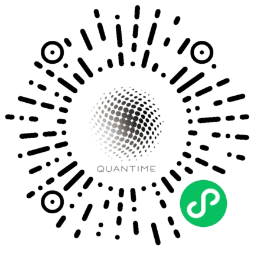

# Quantime - 时间统计工具

**浙江大学： 黄余飞  王青蕊  汪奕晨  徐瑞柏**

### 背景概述

微信10年，依托微信的社交私域流量，微信小程序已经成为一种新的应用形态，**表单统计分发**场景时常见于微信之中，其中，有一类统计需求：时间统计，在当今疫情加速高效线上协同管理办公，微信小程序应用场景进一步拓宽的背景下，却没有得到应有的重视，旧有方案难以适应移动端交互形态，拖累协作效率。

聚焦时间统计这一需求，我们在朴素的“打造移动端交互方便的时间统计小程序”这一想法基础上，开展前期用户访谈以进行需求挖掘，从而衍生出了**Quantime**这样一款时间统计小程序。

### 产品介绍

Quantime通过 Quantum time（时间量子）的物理学概念打造核心产品逻辑，塑造全新的移动交互时间统计哲学，致力于提升时间统计这一场景下的用户体验。

### 产品定位

Quantime是一款简单易用、轻量高效的时间统计微信小程序，帮助用户快速发布时间统计表单，即时查看准确清晰的统计结果，满足不同场景下用户协同开展时间安排的需求。

这样一个轻量级的需求结合微信小程序的特点，恰好可以满足用户**即需即用**的需求，

### 产品特点

* 程序自动生成时间量子概念（按小时粒度）的可选时间选项，减少表单发布负担
* 时间量子颗粒选项匹配时间轴，简单直观，减少表单填写负担
* 时间统计结果支持可视化热图（colorbar）显示，整体情况一眼纵览
* 统计结果详情支持查看带首字母的具体时间参与者列表展示，交互方便

### 盈利方式

该项目未来可选的盈利方式有

+ 提供更精细化的付费功能
  + 如在统计结果呈现上做出更智能，更精准的展现
  + 如在用户可保存的表单数量，类别数量上加以相应的付费等级限制
+ 提供广告位
  + 参考问卷星等类似工具平台，我们可以在产品页面中，创建表单完毕后等处添加相应的广告页，由于我们小程序广泛的传播属性，会为广告带来较高的点击率，从中获取盈利
+ 流量转移
  + 我们可以结合该小程序的应用场景，在同一产品线中继续开发其他产品，在应用场景上形成互补。通过该小程序的流量反哺产品线上的其他产品，而这些产品可能有其自身的盈利方式。

### 推广方向

我们的小程序定位为小工具，依托微信本身的日常社交属性，我们首先要在功能和逻辑上做到尽善尽美，让使用它的用户能实质上优化工作流，切实感受到工作效率的提升。

作为一款消费级小程序，**Quantime现已上线**，当前最重要的工作之一就是用户增长。

在产品本身功能和逻辑完善的基础上，Quantime借助产品本身的分享特性在社交群体中开展推广。

其中，积累原始用户可以说是至关重要，由于我们的目标群体主要是有较多统计需求的在校学生，以及其他一些具有固定此类需求的场景，我们规划有以下推广方案：

1. 在高校内主动地举办相应的校园推广活动，来让更多的人知道我们的产品，邀请同学们体验Quantime，出于其对痛点的完美把握，再自然形成二次传播。
2. 联系各高校的权益部门，借此推广项目，可以提供相应的校园服务。如校园账号认证等。
3. 寻找具有固定此类需求的场景，如小型公司等。主动联系并进行推广，可以针对开发定制功能。
4. 举办相应的宣传活动，如
   + 专注产品本身的特性进行推广活动，如在相应的比赛中进行推荐
   + 结合开发过程进行推广，如举办有奖Logo设计大赛、前端优化方案大赛等