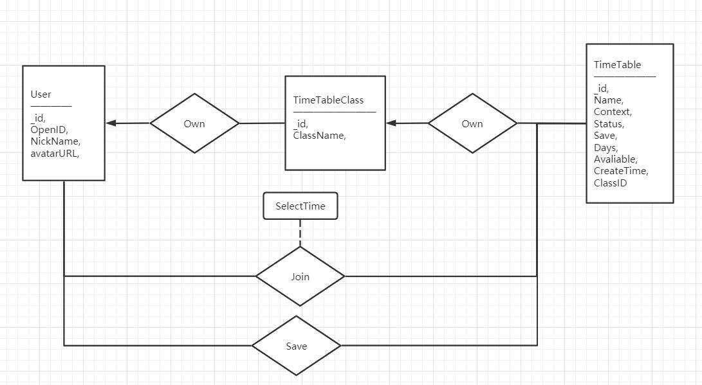

# Quantime展示大纲

各位老师，各位同学：

大家好，我们是来自浙江大学的Quantime开发者团队。

今天给大家介绍的是我们设计一款全新的移动交互时间统计小工具 —— Quantime。

今天的展示会分为产品定位，产品设计，技术实现，应用分析四个模块

### 定位说明

#### 需求分析

合作是当代生活中不可或缺的一部分，随着智能手机的发展，将工作迁移到手机上成为了越来越多人的选择。但，与之对应的各类配套设施迁移仍然在发展过程中。考虑到这一点，我们希望开发一款可以优化手机合作体验的小程序。

我们首先聚焦于大学生活中，对于大学生合作，统计时间成为了各类合作的第一步的难题。

#### 产品定位

想要解决这一问题，微信小程序具有得天独厚的优势

+ 依托微信的私域流量和广泛的传播属性，小程序极易在各群体中传播开来，也更容易保持用户的黏性
+ 同时，以微信群聊为载体，用户不需要额外的学习成本

我们的Quantime就是聚焦这一需求的**高效时间统计小程序**

### 产品设计

#### 产品

由于工具类App的定位，我们在产品设计的方案中以**用户友好**为第一要义

我们希望尽可能缩短用户使用本小程序的时间，因此我们在架构产品时以用户视角为主构建整体框架。

在流程图的右侧，就是用户最常用的几个功能

+ 发布时间统计
+ 分享到群聊
+ 被统计者选择时间
+ 统计者查看统计结果

我们尽可能地简化了这些流程，希望让用户可以**即需即用**，不需要任何多余的操作

我们尽可能地简化了这些流程

接下来我们会以实机视频说明用户操作的全流程

在整体的UI设计方案上，我们希望以简洁明快为主。

因此我们没有使用过于复杂的交互，使用基础的TabBar, Card布局，让用户可以迅速上手。

这也让用户在使用小程序的过程中可以清晰地了解到自己下一步该如何做。

风格，配色等方面的统一也给了用户更流畅的使用体验。

这里我们再就几个我们设计的核心思路进行展开介绍

这里量子化的时间选择是我们项目设计的亮点与创新点之一，可能与一般设计者的 “给用户更多选择” 这样的思路背道而驰。

这是因为在我们经过充分的调研和分析之后我们发现，过于碎粒度的时间选择反而会让用户产生纠结的情绪，也增加了操作的复杂度。

这时反其道而行之，用做减法的思路设计，使用足以囊括大部分场景的量子化设计，就起到了精简的作用。

这也是我们项目名称的来源 Quantime即Quantum Time，量子化的时间。

自动的统计分析是我们的另一亮点与创新点，概览上，我们可以通过色块颜色的深浅直观地看出参与人数的多少。

同时进入统计详情后，可以通过滑动快速浏览各时间参与的具体人员，作出最后的时间安排。

相比于使用问卷星，群投票等传统方法，这给了用户更加直观的结果展示。

### 技术方案

在技术搭建上

采用前端-数据库-后端的经典MVC模型

其中Model，数据库使用小程序云数据库，云数据库支持直接解析json的特性可以让我们在设计数据结构时更加自由，对于本项目，使得我们可以不用为每一个时间量子分配一条记录，而是全部记录在一条json里。

后端使用小程序云函数，充分发挥小程序云开发的特性。

使用云开发，我们可以保证用户openid等敏感信息不会出现在前端，从而保证了我们小程序用户的隐私安全。

同时数据库不同表单设置了不同的读写权限，如TimeTable允许所有人读，只允许创建者写。这使得数据库层面的数据可以防止非法的篡改，更加规范化。

### 应用分析

#### 运营推广

为了及时接收到用户反馈，我们建立了用户反馈群聊，可以有效迅速地解决用户问题。

在推广上，我们考虑先与最广泛的大学生应用场景，可以现在本校内部结合活动进行推广，然后扩展到各个高校。最后扩展应用场景，提升移动场景合作的用户体验。

我们也考虑为具有特殊需求的群体定制功能，实现个性化推广。

#### 商业分析

在盈利模式上，我们主要对标问卷星等小工具。

首先我们聚焦的是小需求领域，并希望在这个领域中做到最好，在特定需求的满足上具有无可比拟的竞品优势。

这使得目标用户，如大学校园中的领导者、活动的组织者会对我们的产品产生较高的依赖，这使得Quantime在用户心中可以具有较高的辨识度，想到时间统计，就会想到我们的产品。

结合这些特性再去考虑盈利

+ 首先，我们可以扩展付费功能，如更高级的结果统计展示等
+ 其次，类似问卷星，我们可以凭借工具类小程序较高的流量，设置广告位盈利
+ 本时间统计小程序的开发只是我们最开始思路中，移动场景合作模式优化的一小部分，在未来我们拓宽这一生态时，Quantime可以起到为产品线上其他产品引流的作用。

#### 发展方向

考虑未来Quantime小程序的发展方向

+ 在领域内，也就是时间统计功能上，可以继续发展。提供更优的交互逻辑和更完善的时间统计结果展示，加入更多的可视化功能，结合算法提供更人性化的智能推荐等
+ 在广度的发展上，就回到了我们最初的想法，移动场景下合作体验的优化。建立整套的产品生态，融入更多的合作上的功能，如文件管理，记录协作等等

以上就是我们小程序的整体内容，希望我们的小程序能够连接着人们，作时间量子之海的一叶轻舟，将大家载往共同的理想坐标，谢谢大家。

